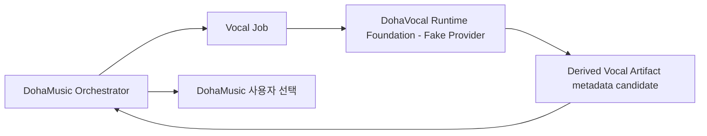

# DohaVocal

> 문서 상태: [진행 중]
> Foundation 상태: Runtime Foundation, Provider API Foundation, Fake Provider [구현]
> 모델 상태: 실제 AI Singing Voice, Voice Conversion, Vocal Correction, Training, Evaluation, Production Runtime [미구현]
> Payload 계약: `0.1.0` metadata-only [구현] / `0.2.0` payload-backed Fake Runtime [구현]
> 공통 명세: `0.1.0` / `draft-baseline`
> 명세 기준: `DohaStudio/.github` `main` (`1e4b480c8cbd6e51835f8550e685e9b136d8071d`)

DohaVocal은 DohaMusic의 보컬 AI Provider입니다. AI Singing Voice, Voice Conversion, Vocal Correction, Vocal Dataset, Training, Evaluation과 독립 Runtime을 기술적으로 담당할 계획입니다.

현재 저장소에는 공통 Vocal Job 계약, 기본 in-memory 및 선택적 SQLite durable lifecycle·idempotency, metadata-only 및 payload-backed Fake Provider와 FastAPI Runtime Foundation이 구현되어 있습니다. Fake Provider는 사용자 오디오에 접근하지 않으며 모델, GPU, Dataset, Checkpoint와 외부 Provider를 사용하지 않습니다.

논리 Provider 식별자는 Runtime 구현 방식과 분리된 `dohavocal`입니다. Fake Manifest는 기존 `dohavocal.fake-model@0.1.0`과 payload 전용 `dohavocal.fake-model@0.2.0`으로 구분합니다. 이후 local·remote·Production Runtime으로 구현이 바뀌어도 같은 논리 Provider의 `provider_id`는 유지합니다.

## 책임

- AI Singing Voice Generation과 Voice Conversion [계획]
- Pitch·Timing Correction, Beat Alignment와 Auto-Tune [계획]
- Noise Reduction, Breath·Silence Cleanup [계획]
- Vocal Normalization·Enhancement·Quality Analysis [계획]
- Vocal Dataset, Training·Fine-tuning·Evaluation [계획]
- 사용자별 Adapter/Checkpoint [계획]
- Model Manifest 계약과 Runtime API Foundation [구현]

## 비목표

DohaVocal은 Frontend, 사용자 계정, Workspace, Music Project, Lyrics/Music Generation, Stem Separation, Composition Snapshot, Mix, Mastering, Export, 녹음 UI와 음성 사용 권한의 최종 판단을 담당하지 않습니다.

## DohaMusic과의 관계

모든 호출은 DohaMusic 제품 서비스와 Workspace·Job Orchestrator를 경유합니다. DohaVocal은 DohaAudio나 DohaLM을 직접 호출하지 않으며 다른 Provider도 DohaVocal을 직접 호출하지 않습니다.

DohaMusic은 사용자·동의·접근 권한·삭제 결정, Recording Take와 작품 버전, 보정 후보 선택, Composition Snapshot, Mix와 Export를 소유합니다. DohaVocal은 승인된 입력에 대한 기술적 보컬 처리와 결과 Metadata를 제공합니다.

`VocalGenerationJob`, `VoiceConversionJob`, `PitchCorrectionJob`, `TimingCorrectionJob`, `VocalCorrectionJob`, `NoiseReductionJob`, `VocalAnalysisJob`, `EnrollmentProcessingJob`은 서로 독립된 Job입니다. 한 Job의 성공이 다른 Job을 자동 실행하지 않으며, 각 Job은 기존 AssetVersion 또는 Artifact를 입력받아 원본을 변경하지 않고 새 파생 AssetVersion 또는 Artifact를 생성합니다.



## 서로 다른 엔티티

다음은 절대 같은 엔티티로 취급하지 않습니다.

1. 음색 등록 Sample(`Voice Enrollment Sample`)
2. 작품 녹음 Take(`Recording Take`)
3. Vocal 학습 Dataset
4. AI 생성 Vocal
5. 음색 변환 Vocal
6. 처리된 Vocal Asset
7. 최종 선택 Vocal

Voice Enrollment Sample과 Recording Take는 자동으로 Training Dataset이 되지 않습니다. Training에는 별도의 명시적 승인과 Dataset Manifest가 필요합니다.

## 원본 불변과 파생 AssetVersion

원본 보컬을 덮어쓰지 않습니다. 모든 처리는 새 파생 Artifact와 AssetVersion 후보를 생성하고 `source_asset_version_id`, `parent_asset_version_id`, `processing_chain_id`, `model_manifest_id`, 설정 snapshot과 checksum을 기록합니다. 최종 Workspace AssetVersion 선택은 DohaMusic이 수행합니다.

## 외부 저장소

| 구분 | 기준 루트 | Git 포함 |
|---|---|---|
| Vocal Dataset | `DohaData/vocal` | 금지 |
| Vocal Artifact | `DohaArtifacts/vocal` | 금지 |
| 임시 파일 | `DohaTemp/vocal` | 금지 |
| Mix·Export·Preview·Snapshot | `DohaArtifacts/music` | DohaVocal 범위 아님 |

기본 memory mode는 로컬 저장소에 접근하지 않습니다. 선택적 SQLite mode는 trusted configuration의 Git 외부 DB에 Job·Result·source와 합성 Fake bytes BLOB을 함께 보관합니다. Production Artifact에는 접근하지 않습니다. Production Artifact Catalog·Resolver 연동은 [미구현]입니다.

Fake 결과의 `artifact_checksum`은 실제 audio payload checksum이 아니라 canonical metadata descriptor의 SHA-256이며 `checksum_scope=metadata_descriptor`로 구분합니다. 0.1.0은 `payload_present=false`이며, 0.2.0의 실제 byte checksum은 별도 `payloads[].payload_checksum`입니다.

구현된 payload-backed Fake Result는 [Provider Payload Acquisition 계약](docs/03-architecture/provider-payload-acquisition-contract.md)의 `0.2.0` TARGET을 따릅니다. stable non-secret `provider_subresource` identity와 별도 binary acquisition operation을 사용하고 credential, signed URL과 로컬 경로를 Result에 포함하지 않습니다. Fake binary endpoint, deterministic WAV/JSON bytes와 durable persistence foundation은 구현했습니다. Production Runtime 전체, authentication, rights enforcement와 실제 AI inference는 [미구현]입니다.

## Runtime Foundation 실행

Python 3.12 환경에서 개발 의존성을 설치한 뒤 다음 명령을 사용할 수 있습니다.

```text
python -m pip install -e ".[dev]"
dohavocal
```

기본 개발 주소는 `http://127.0.0.1:8080`이며 `/health`, `/ready`, `/v1/capabilities`, `/v1/jobs`와 Model Manifest 조회 API를 제공합니다. 이 실행 경로는 개발·계약 검증용 Fake Runtime이며 Production Runtime이 아닙니다.

### 명시적 0.2.0 선택

기본 `GET /v1/capabilities`는 기존 0.1.0 shape를 유지합니다. `GET /v1/capabilities?api_contract_version=0.2.0`으로 10개 operation과 payload 지원을 확인한 뒤, CreateJob body에 `api_contract_version=0.2.0`, `model_manifest_id=dohavocal.fake-model@0.2.0`을 지정합니다. GetResult는 저장된 Job 버전을 따르며 descriptor의 Job·artifact·source를 이용해 `GET /v1/jobs/{job_id}/artifacts/{provider_artifact_id}/payloads/{source_id}`에서 bytes를 받습니다.

Fake bytes는 100 ms 무음 WAV 또는 canonical analysis JSON입니다. 기본 memory mode의 Result/source/bytes는 재시작 시 소실됩니다. explicit SQLite mode에서는 동일 DB를 다시 열어 exact identity와 bytes를 복구합니다. `available_until=null`은 memory mode에서 process 수명에 한정되며 durable mode에서는 restart로 만료되지 않습니다. 운영 보존·권리 보장은 아닙니다. 자세한 측정과 한계는 [검증 기록](docs/08-runtime/payload-runtime-validation.md)을 참조합니다.

## 문서 읽기 순서

1. [DohaStudio 공통 명세 기준선](https://github.com/DohaStudio/.github/tree/main/docs/specifications)
2. [DohaStudio 공통 Provider 계약](https://github.com/DohaStudio/.github/blob/main/docs/specifications/04-provider-contract.md)
3. [DohaStudio 공통 용어](https://github.com/DohaStudio/.github/blob/main/docs/specifications/10-common-terms.md)
4. [프로젝트 개요](docs/00-overview/project-overview.md)
5. [Repository Boundary](docs/00-overview/repository-boundary.md)
6. [기능 요구사항](docs/02-requirements/functional-requirements.md)
7. [System Architecture](docs/03-architecture/system-architecture.md)
8. [Provider Payload Acquisition 계약](docs/03-architecture/provider-payload-acquisition-contract.md)
9. [Vocal Asset Lineage](docs/03-architecture/vocal-asset-lineage.md)
10. [Consent와 권리](docs/05-data/consent-and-rights.md)
11. [문서 인덱스](docs/index.md)

전체 단계는 [Roadmap](ROADMAP.md), 변경 기록은 [CHANGELOG](CHANGELOG.md), 결정 제안은 [ADR 인덱스](docs/10-decisions/README.md)에서 확인합니다.

## 라이선스와 상업 이용

이 저장소의 코드와 문서는 [Apache License 2.0](LICENSE)을 따릅니다. Dataset, 개인 음성, Voice Enrollment Sample, Recording Take, 외부 모델, 모델 가중치, Checkpoint, Adapter, 생성 보컬, 변환 보컬, 보정 결과, 평가 샘플, 동의 증적과 제3자 콘텐츠에는 저장소의 Apache-2.0이 적용되지 않으며 각 항목의 별도 권리와 라이선스를 따릅니다.

## Durable Runtime 실행

기존 `dohavocal`은 memory mode다. repository 밖에 operator가 관리하는 전용 directory를 먼저 준비하고 최초 한 번만 `dohavocal --runtime-mode sqlite --database <absolute-external-db> --initialize-database`로 초기화한다. 이후 실행은 같은 DB에 `--initialize-database` 없이 시작한다. 재시작 때 DB가 없어도 빈 DB로 대체하지 않는다. filename은 configuration이며 source ID와 무관하다. 신규 DB에만 bootstrap하고 기존 schema를 자동 upgrade하지 않는다.

Python composition은 `create_app(settings=RuntimeSettings(runtime_mode="sqlite", database_path=trusted_path))`를 사용한다. 테스트는 context-managed TestClient, CLI는 FastAPI lifespan으로 종료한다. 각 transaction connection은 commit/rollback 후 닫히며 shutdown 이후 저장소 호출은 거부된다. startup 실패는 서버 시작을 막고 실행 중 storage failure는 `/ready` 503, process health는 `/health` 200이다.

선택 근거와 복구 정책은 [ADR-007](docs/10-decisions/ADR-007-durable-runtime-persistence.md), 스키마와 실행 증거는 [durable 검증 기록](docs/08-runtime/durable-runtime-persistence-validation.md)을 따른다. Existing process-local runtime state is non-durable and is not migrated. 삭제·권리철회·historical identity와 bytes 정리는 서로 다른 authority이며 임의 cleanup API를 추가하지 않는다.

Fake Model Manifest는 memory/SQLite mode와 process restart에 관계없이 동일 ID에 동일 document를 반환합니다. `created_at`은 Runtime 시작 시각이 아닌 역사적 descriptor publication 시각입니다. 실제 storage mode는 실행 설정에서 선택하며 immutable Manifest의 `persistence=runtime-configured`를 현재 인스턴스의 durability 보장으로 해석하지 않습니다. [Manifest authority](docs/04-models/model-manifest-schema.md)와 [재시작 검증](docs/08-runtime/manifest-restart-invariance-validation.md)을 참조합니다.
