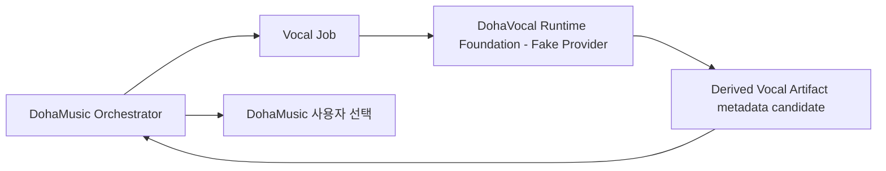

# DohaVocal

> 문서 상태: [진행 중]
> Foundation 상태: Runtime Foundation, Provider API Foundation, Fake Provider [구현]
> 모델 상태: 실제 AI Singing Voice, Voice Conversion, Vocal Correction, Training, Evaluation, Production Runtime [미구현]
> 공통 명세: `0.1.0` / `draft-baseline`
> 명세 기준: `DohaStudio/.github` `main` (`1e4b480c8cbd6e51835f8550e685e9b136d8071d`)

DohaVocal은 DohaMusic의 보컬 AI Provider입니다. AI Singing Voice, Voice Conversion, Vocal Correction, Vocal Dataset, Training, Evaluation과 독립 Runtime을 기술적으로 담당할 계획입니다.

현재 저장소에는 공통 Vocal Job 계약, in-memory lifecycle·idempotency, metadata-only Fake Provider와 FastAPI Runtime Foundation이 구현되어 있습니다. Fake Provider는 실제 오디오를 읽거나 쓰지 않으며 모델, GPU, Dataset, Checkpoint와 외부 Provider를 사용하지 않습니다.

## 책임

- AI Singing Voice Generation과 Voice Conversion [계획]
- Pitch·Timing Correction, Beat Alignment와 Auto-Tune [계획]
- Noise Reduction, Breath·Silence Cleanup [계획]
- Vocal Normalization·Enhancement·Quality Analysis [계획]
- Vocal Dataset, Training·Fine-tuning·Evaluation [계획]
- 사용자별 Adapter/Checkpoint [계획]
- Model Manifest 계약과 Runtime API Foundation [구현]

## 비목표

DohaVocal은 Frontend, 사용자 계정, Workspace, Music Project, Lyrics/Music Generation, Stem Separation, Composition Snapshot, Mix, Mastering, Export, 녹음 UI와 음성 사용 권한의 최종 판단을 담당하지 않습니다.

## DohaMusic과의 관계

모든 호출은 DohaMusic 제품 서비스와 Workspace·Job Orchestrator를 경유합니다. DohaVocal은 DohaAudio나 DohaLM을 직접 호출하지 않으며 다른 Provider도 DohaVocal을 직접 호출하지 않습니다.

DohaMusic은 사용자·동의·접근 권한·삭제 결정, Recording Take와 작품 버전, 보정 후보 선택, Composition Snapshot, Mix와 Export를 소유합니다. DohaVocal은 승인된 입력에 대한 기술적 보컬 처리와 결과 Metadata를 제공합니다.

`VocalGenerationJob`, `VoiceConversionJob`, `PitchCorrectionJob`, `TimingCorrectionJob`, `VocalCorrectionJob`, `NoiseReductionJob`, `VocalAnalysisJob`, `EnrollmentProcessingJob`은 서로 독립된 Job입니다. 한 Job의 성공이 다른 Job을 자동 실행하지 않으며, 각 Job은 기존 AssetVersion 또는 Artifact를 입력받아 원본을 변경하지 않고 새 파생 AssetVersion 또는 Artifact를 생성합니다.



## 서로 다른 엔티티

다음은 절대 같은 엔티티로 취급하지 않습니다.

1. 음색 등록 Sample(`Voice Enrollment Sample`)
2. 작품 녹음 Take(`Recording Take`)
3. Vocal 학습 Dataset
4. AI 생성 Vocal
5. 음색 변환 Vocal
6. 처리된 Vocal Asset
7. 최종 선택 Vocal

Voice Enrollment Sample과 Recording Take는 자동으로 Training Dataset이 되지 않습니다. Training에는 별도의 명시적 승인과 Dataset Manifest가 필요합니다.

## 원본 불변과 파생 AssetVersion

원본 보컬을 덮어쓰지 않습니다. 모든 처리는 새 파생 Artifact와 AssetVersion 후보를 생성하고 `source_asset_version_id`, `parent_asset_version_id`, `processing_chain_id`, `model_manifest_id`, 설정 snapshot과 checksum을 기록합니다. 최종 Workspace AssetVersion 선택은 DohaMusic이 수행합니다.

## 외부 저장소

| 구분 | 기준 루트 | Git 포함 |
|---|---|---|
| Vocal Dataset | `DohaData/vocal` | 금지 |
| Vocal Artifact | `DohaArtifacts/vocal` | 금지 |
| 임시 파일 | `DohaTemp/vocal` | 금지 |
| Mix·Export·Preview·Snapshot | `DohaArtifacts/music` | DohaVocal 범위 아님 |

Runtime Foundation은 Artifact payload나 로컬 저장 경로에 접근하지 않고 파생 후보의 ID, checksum과 lineage metadata만 in-memory로 생성합니다. Production Artifact Catalog·Resolver 연동은 [미구현]입니다.

Fake 결과의 `artifact_checksum`은 실제 audio payload checksum이 아니라 canonical metadata descriptor의 SHA-256이며 `checksum_scope=metadata_descriptor`, `payload_present=false`로 구분합니다.

## Runtime Foundation 실행

Python 3.12 환경에서 개발 의존성을 설치한 뒤 다음 명령을 사용할 수 있습니다.

```text
python -m pip install -e ".[dev]"
dohavocal
```

기본 개발 주소는 `http://127.0.0.1:8080`이며 `/health`, `/ready`, `/v1/capabilities`, `/v1/jobs`와 Model Manifest 조회 API를 제공합니다. 이 실행 경로는 개발·계약 검증용 Fake Runtime이며 Production Runtime이 아닙니다.

## 문서 읽기 순서

1. [DohaStudio 공통 명세 기준선](https://github.com/DohaStudio/.github/tree/main/docs/specifications)
2. [DohaStudio 공통 Provider 계약](https://github.com/DohaStudio/.github/blob/main/docs/specifications/04-provider-contract.md)
3. [DohaStudio 공통 용어](https://github.com/DohaStudio/.github/blob/main/docs/specifications/10-common-terms.md)
4. [프로젝트 개요](docs/00-overview/project-overview.md)
5. [Repository Boundary](docs/00-overview/repository-boundary.md)
6. [기능 요구사항](docs/02-requirements/functional-requirements.md)
7. [System Architecture](docs/03-architecture/system-architecture.md)
8. [Vocal Asset Lineage](docs/03-architecture/vocal-asset-lineage.md)
9. [Consent와 권리](docs/05-data/consent-and-rights.md)
10. [문서 인덱스](docs/index.md)

전체 단계는 [Roadmap](ROADMAP.md), 변경 기록은 [CHANGELOG](CHANGELOG.md), 결정 제안은 [ADR 인덱스](docs/10-decisions/README.md)에서 확인합니다.

## 라이선스와 상업 이용

이 저장소의 코드와 문서는 [Apache License 2.0](LICENSE)을 따릅니다. Dataset, 개인 음성, Voice Enrollment Sample, Recording Take, 외부 모델, 모델 가중치, Checkpoint, Adapter, 생성 보컬, 변환 보컬, 보정 결과, 평가 샘플, 동의 증적과 제3자 콘텐츠에는 저장소의 Apache-2.0이 적용되지 않으며 각 항목의 별도 권리와 라이선스를 따릅니다.
