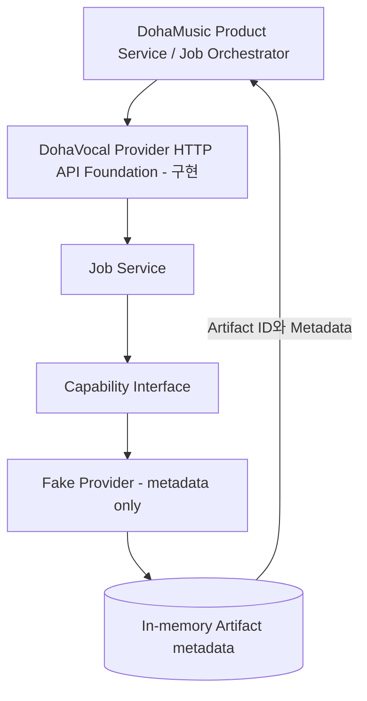

# 시스템 아키텍처

> 문서 상태: [진행 중]

DohaMusic이 사용 권한, 입력 선택, GPU admission, Provider 순서와 Workspace 상태를 관리합니다. DohaVocal은 할당된 기술 처리와 Provider 내부 자원을 관리합니다.

현재 구현은 `API → Application Service → Provider interface → Fake Provider` 경계를 검증합니다. 실제 Model Adapter, Artifact payload 저장소, queue/worker와 Production persistence는 [미구현]입니다.

HTTP wire contract의 논리 Provider ID는 `dohavocal`로 고정합니다. diagram의 Fake Provider는 현재 Runtime implementation을 뜻하며 별도 Provider identity가 아닙니다.
