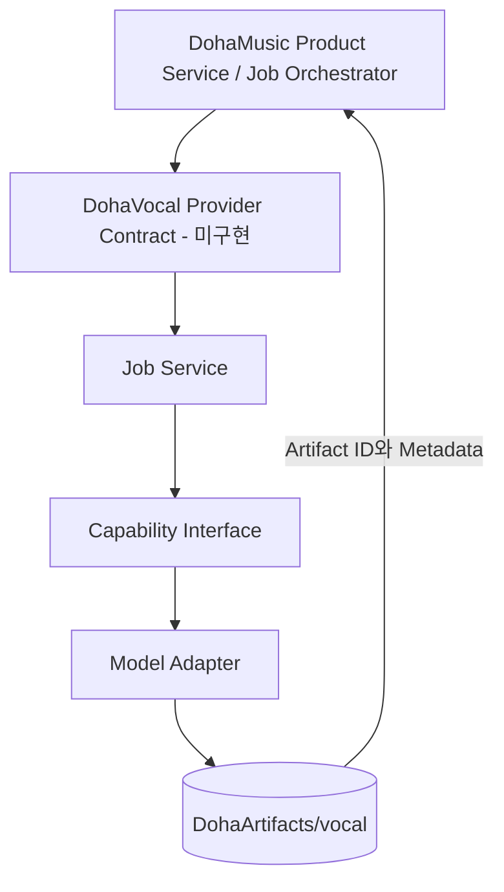

# System Architecture

> 문서 상태: [계획]

```mermaid
flowchart TB
    DM[DohaMusic Product Service / Job Orchestrator]
    API[DohaVocal Provider Contract - 미구현]
    APP[Job Service]
    CAP[Capability Interface]
    ADP[Model Adapter]
    ART[(DohaArtifacts/vocal)]

    DM --> API --> APP --> CAP --> ADP --> ART
    ART -->|Artifact ID와 Metadata| DM
```

DohaMusic이 사용 권한, 입력 선택, GPU admission, Provider 순서와 Workspace 상태를 관리합니다. DohaVocal은 할당된 기술 처리와 Provider 내부 자원을 관리합니다.
