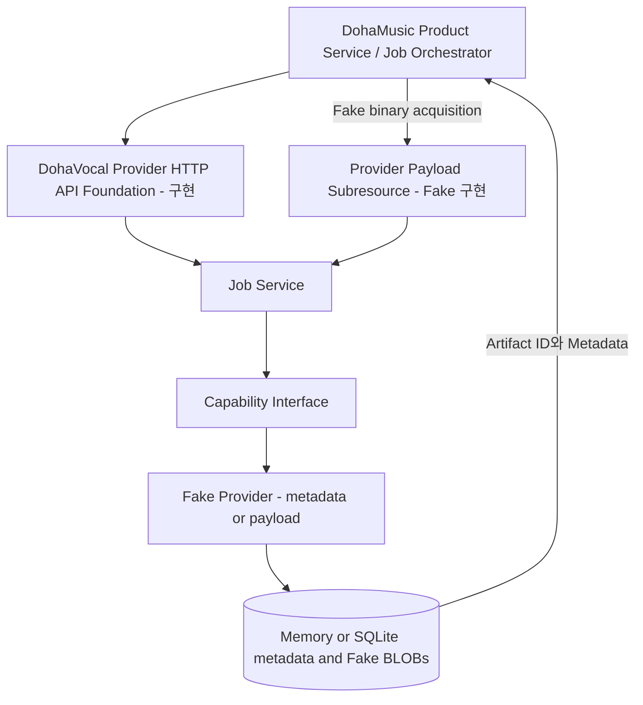

# 시스템 아키텍처

> 문서 상태: [진행 중]

DohaMusic이 사용 권한, 입력 선택, GPU admission, Provider 순서와 Workspace 상태를 관리합니다. DohaVocal은 할당된 기술 처리와 Provider 내부 자원을 관리합니다.

현재 구현은 `API → Application Service → Provider interface → Fake Provider` 경계를 검증합니다. 선택적 SQLite durable adapter와 transaction unit of work는 [구현]입니다. 실제 Model Adapter, Production Artifact 연동, queue/worker 및 Production Runtime 전체는 [미구현]입니다.

TARGET payload-backed 흐름은 Result의 stable non-secret source descriptor와 Provider-owned binary subresource를 분리한다. DohaVocal이 source lifetime과 bytes 제공을, DohaMusic이 권한 재검증·실제 byte 무결성·staging·Durable Locator와 Workspace Artifact 등록을 소유한다. 상세 계약은 [Provider Payload Acquisition 계약](provider-payload-acquisition-contract.md)을 따른다.

HTTP wire contract의 논리 Provider ID는 `dohavocal`로 고정합니다. diagram의 Fake Provider는 현재 Runtime implementation을 뜻하며 별도 Provider identity가 아닙니다.

Payload descriptor와 bytes는 memory mode에서 별도 in-memory adapter에 저장합니다. durable mode는 별도 SQLite table을 하나의 transaction authority로 묶습니다. Router는 Service/Provider port가 반환하는 HTTP 독립 content를 StreamingResponse로 변환하며 Provider 내부 store에 접근하지 않습니다. Production authentication·rights는 [미구현]입니다.
