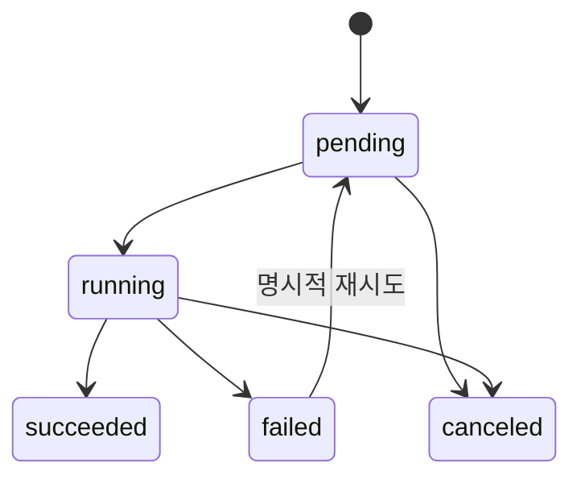

# Job 수명 주기

> 문서 상태: [제안]

공통 필드는 `job_id`, `job_type`, `status`, `progress_percent`, `provider_id`, `api_contract_version`, `model_manifest_id`, input/output Artifact ID, settings snapshot, retry parent, error와 생성·완료 시각입니다.

실패 Job은 입력 원본이나 다른 성공 후보를 삭제하지 않습니다. Retry는 새 attempt와 `retry_of_job_id`를 가집니다.
