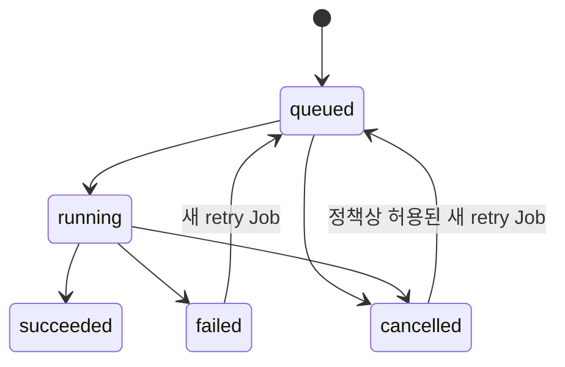

# Job 수명 주기

> 문서 상태: [구현]

공통 필드는 `job_id`, `job_type`, `status`, `progress_percent`, `provider_id`, `api_contract_version`, `model_manifest_id`, input/output Artifact ID, settings snapshot, retry parent, error와 생성·완료 시각입니다.

실패 Job은 입력 원본이나 다른 성공 후보를 삭제하지 않습니다. Retry는 새 attempt와 `retry_of_job_id`를 가집니다.

종료 상태는 재변경할 수 없습니다. Retry는 기존 status, error와 input snapshot을 보존하고 새 `job_id`를 발급합니다. 현재 in-memory 구현은 단일 process의 계약 검증 범위이며 영속화와 분산 동시성은 [미구현]입니다.

`failed` 전이에는 구조화된 `error`, `succeeded` 전이에는 검증된 output ID가 필요합니다. 단일 process 안의 상태 교체는 현재 status를 비교한 atomic operation으로 처리하지만 multi-worker·분산 동시성을 보장하지 않습니다.

TARGET payload-backed Result에서 Provider Job `succeeded`와 payload acquisition transfer는 분리합니다. 성공 뒤 transfer cancellation은 진행 중인 binary read를 중단할 뿐 terminal Job, Result identity 또는 source binding을 변경하지 않습니다. acquisition failure도 자동 `RetryJob`이나 inference 재실행으로 변환하지 않으며 [Provider Payload Acquisition 계약](../03-architecture/provider-payload-acquisition-contract.md)의 별도 retry·error boundary를 따릅니다.
